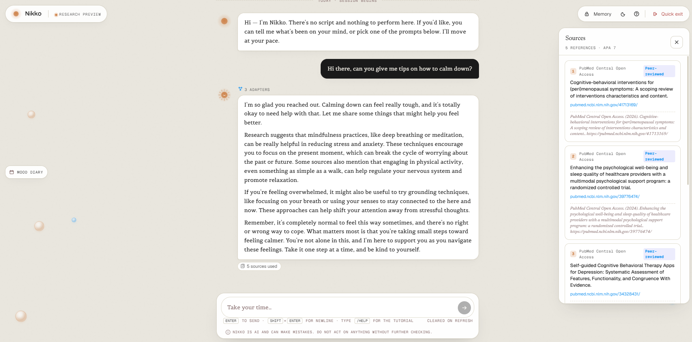

Nikko is a safety-aligned, evidence-grounded LLM ecosystem designed to function as a compassionate digital mental wellbeing companion. It listens, validates, and surfaces reliable information — but it never diagnoses, never prescribes, and always defers to human care when it matters most.

> *Nikko illuminates possible paths. The user must always walk toward human support themselves.*

---

## Project Status

> **MVP.** The full stack is deployed end-to-end. All core features are wired and live. Phase 6 (end-to-end evaluation) is active — running ongoing evaluation, UX refinement, and latency work in parallel with production usage.

| Layer | Status |
|-------|--------|
| Phase 1–2 — Specifications (8 + 3 supplementary) | ✅ Complete |
| Phase 3 — Agent pipeline (7 specialist agents) | ✅ Complete |
| Phase 4 — ADP-C fine-tuning (Gemma-2-2b-it) | ✅ Complete |
| Phase 4 — ADP-B fine-tuning (Gemma-2-2b-it) | ✅ Complete |
| Phase 4 — ADP-A (Qwen3-4B base, no LoRA) | ⛔ Fine-tuning discontinued — Qwen3-4B base used directly in production |
| Phase 7 — Deployment infra (Modal + Render + GH Pages) | ✅ Live (pulled forward of Phase 6) |
| Frontend SPA | ✅ Complete |
| Phase 5 — Backend API integration | ✅ Complete |
| Phase 6 — End-to-end evaluation | 🔨 Active — running alongside UX + backend speed refinement |

---

## Proof of Concept

> Full pipeline running end-to-end: user message → ADP-B crisis check → ADP-A empathy response → ADP-C evaluation → frontend with live source citations.



*The "3 ADAPTERS" badge confirms ADP-B → ADP-A → ADP-C all ran in a single ZeroGPU session. Sources panel shows APA7-formatted PubMed citations pulled live by the retrieval layer.*

---

## What Nikko Is

Nikko is not a chatbot. It is a **multi-agent pipeline** in which every user message passes through a sequence of specialist agents before a response is generated. No single agent has the whole picture — each one does one job, checks its own constraints, and hands off to the next. The LLM that generates the final response never receives raw user input, never accesses evidence directly, and never decides whether the response is safe. Other agents handle those concerns before and after the model runs.

This architecture exists because mental-health-adjacent AI carries real risk. A single unconstrained LLM can confidently say the wrong thing. A pipeline with hard-coded routing rules, a regex-based safety gate, and a structural integrity check is much harder to break.

Nikko is meant to be used as a digital mental wellbeing companion - capable of evidence-based mental health first aid that is safe and private by design, but never meant to replace professional help provided by humans.

---

## Governing Principles

Nikko exists to support — not to replace. The full ethical charter is in `docs/specs/SPEC-000-charter.md`. The short version:

- Nikko will not diagnose, prescribe, or plan treatment.
- Nikko will not simulate being a therapist.
- Nikko will not encourage exclusive reliance on itself.
- When risk increases, Nikko increases its encouragement toward human support — it does not increase its own authority.

---

## Model Stack

Nikko uses a **dual-model architecture** built around two base models and three specialised LoRA adapters (ADP = Adapter). The previous candidate — Mistral-7B-Instruct-v0.3 — was retired after proving infeasible on an RTX 3070 8 GB (14 GB fp16 requirement, 14+ hours training with no convergence). All Mistral artefacts are preserved under `*/mistral-7b/`.

| Adapter | Base model | Role | Temperature |
|---------|-----------|------|-------------|
| **ADP-A** | Qwen3-4B (4B, Alibaba Qwen Team, Apache-2.0) | Empathy — generates the user-facing response | 0.75 (warm, varied) |
| **ADP-B** | Gemma-2-2b-it (2.0B, Google Gemma licence) | Safety / crisis classifier | 0.2 (near-deterministic JSON) |
| **ADP-C** | Gemma-2-2b-it (same base as ADP-B) | Response quality evaluator | 0.2 (near-deterministic JSON) |

### Why two base models?

Qwen3-4B produces strong zero-shot empathic responses at the 4B parameter scale without fine-tuning — tasks that reward generative diversity and natural language fluency. Gemma-2-2b-it is better suited to structured classification tasks (binary crisis flags, APPROVE/REGENERATE verdicts) where compact JSON output and near-greedy decoding matter more than creativity. ADP-B and ADP-C **share the Gemma-2 base**: they are loaded once as a single `PeftModel`, and `set_adapter()` hot-swaps their LoRA delta tensors at O(1) cost — no weight duplication, no second model load.

### What a LoRA adapter is

A LoRA (Low-Rank Adaptation) adapter is a small set of weight deltas — typically 50–100 MB — stored separately from the base model. During inference, the adapter's delta tensors are added to the base model's weight matrices, steering the model toward a specific task. Swapping adapters means replacing those delta tensors; the base model weights never change. This is why ADP-B and ADP-C can coexist in the same `PeftModel` and be selected at runtime with a single `set_adapter()` call.

### VRAM budget (Modal A10G 24 GB — production)

```
Qwen3-4B              (4.0B bf16)  ~  8.0 GB  (ADP-A)
Gemma-2-2b-it         (2.0B bf16)  ~  4.5 GB  (ADP-B + ADP-C shared)
Adapter weights (2 × ~50 MB)       ~  0.1 GB
Activations + overhead             ~  2.0 GB
────────────────────────────────────────────
Total estimated                    ~ 14.6 GB   (fits A10G 24 GB with 9.4 GB headroom)
```

`bitsandbytes` / NF4 quantization is not used — both models load cleanly in native bf16 within the A10G budget and quantization adds complexity without meaningful latency benefit at this parameter scale.

> **HF Space fallback:** The fallback ZeroGPU endpoint runs on H200 (70 GB VRAM per slice), not A10G. The same bf16 weights fit with significantly more headroom. `bitsandbytes` remains excluded from `hf_space/requirements.txt` because ZeroGPU defers CUDA allocation until inside a `@spaces.GPU` context — bitsandbytes checks for CUDA at import time and crashes. This restriction does not apply to Modal (CUDA available from container startup).

---

## How the Pipeline Works

A user message flows through the stages below. Agent logic lives in `agents/` and `orchestration/`; the primary production inference layer is in `nikko_modal/app.py` (Modal Serverless), with `hf_space/app.py` as the ZeroGPU fallback.

> *Step numbers follow the SPEC-700 execution order. Some step IDs are reserved for parallel branches or adjacent operations not surfaced in this overview (Steps 9 and 14, for example, are reserved for orchestrator-internal bookkeeping not visible to the agents themselves).*

### STEP 0 — Scope Classification

The **Scope Classifier** uses a weighted keyword scorer — no LLM — to decide whether the message falls within Nikko's domain of emotional wellbeing and mental health support. If it clearly does not, the pipeline stops immediately and returns a static warm-redirect response. Ambiguous messages are passed through.

### STEP 1 — Input Sanitisation

The message is stripped of PII patterns, control characters, and anything exceeding safe input lengths. The sanitised text is what every downstream agent sees.

### STEP 2 — Psychological Signal Detection

The **Signal Agent** makes the first LLM call. It receives the sanitised text and returns a structured `SignalPayload` — a validated, immutable data object describing detected distress level (LOW / MODERATE / HIGH / CRISIS), emotional states, cognitive patterns, risk indicators, and what kind of support the user appears to need.

In production (Phase 4+) this is Qwen3-4B (base model, no LoRA) accessed via the Modal `/pipeline` endpoint. During Phase 3 development it ran on Qwen2.5-3B-Instruct zero-shot locally.

### STEP 3 — Routing

The **Router** reads the `SignalPayload` and assigns exactly one operational mode using deterministic rules — no LLM. Its decision is the single source of truth for everything that follows.

- **COMFORT** — validation, active listening, no information injection.
- **GUIDANCE** — calm, evidence-grounded information for users seeking understanding.
- **CRISIS** — immediate safety priority; evidence pipeline is skipped; crisis resources are injected unconditionally; ADP-B response is used directly.

### STEPs 4–8 — Evidence Retrieval and Synthesis (Guidance Mode only)

If the Router assigned GUIDANCE, the **PubMed Adapter** queries NCBI's research database and the **Web Search Adapter** searches five sanctioned health-information domains (Healthdirect Australia, Better Health Channel, the World Health Organization, Beyond Blue, and Black Dog Institute). Results are cached on disk.

The **Evidence Synthesizer** then ranks all retrieved items by quality — peer-reviewed content within the last five years scores highest — and produces a single `SynthesizedEvidence` object. No LLM is involved in ranking or scoring.

### STEP 4 (parallel) — Support Strategy

The **Support Strategy Agent** makes the second LLM call. It runs in parallel with Evidence Retrieval. It receives the Router's mode and Signal payload and returns communication guidance for the Interaction Model: tone, framing strategy, and constraints. It never generates user-facing text. In Crisis Mode this step is bypassed — a fixed, hardcoded strategy object is injected instead.

### STEP 10 — Draft Generation (ADP-A)

The **Interaction Model** runs. It receives a `ResponseContextPayload` — strategy guidance, synthesised evidence if any, and the mode — and generates the empathetic user-facing response.

In production this is **ADP-A: Qwen3-4B** (base model, no LoRA for MVP) used for empathetic, non-diagnostic wellbeing responses. The model has no access to raw retrieval results, intermediate agent outputs, or conversation history beyond what the payload explicitly contains.

### STEP 11 — Evaluation (ADP-C)

The **Evaluator Agent** is the content gate. It runs two passes:

**Pass 1 (deterministic):** fifteen regex-based red lines are checked against the draft. These catch diagnostic labelling, treatment recommendations, clinical authority framing, and self-harm method disclosure. A single match blocks the response immediately.

**Pass 2 (LLM judge, ADP-C):** **Gemma-2-2b-it** with the ADP-C evaluator adapter checks tone compliance and hallucination indicators. A `REGENERATE` verdict triggers a full re-run of draft generation (up to two times) before falling back to a safe canned response. `set_adapter("adp_c")` switches the shared Gemma-2 base from its ADP-B safety role to its ADP-C evaluator role at no VRAM cost.

### STEP 12 — Verification Supervisor

The **Verification Supervisor** checks structural pipeline integrity — right agents in the right order, crisis resources present when they should be, evidence present in Guidance and absent in Comfort. A structural failure triggers a safe fallback response.

### STEP 13 — Assembly

The final `PipelineResult` is assembled: response text, mode, crisis resources if any, evaluation result, verification result, and a full execution trace.

### STEP 15 — Trace Capture

A `PipelineTrace` records every agent that ran, the router decision, distress level, evidence used, latency, and whether a safe fallback was used. Traces are session-scoped and ephemeral — never written to persistent storage.

---

## The ADP Pipeline in Production

In the deployed stack, all three adapter passes run inside a **single GPU session** on Modal Serverless. This consolidation means both models stay resident in VRAM for the entire turn, paying the CPU→VRAM transfer cost once rather than three times. Warm-turn latency: ~20–40s. Cold start: ~30–60s (Volume read) vs ~90–120s (HF Hub download on ZeroGPU).

If Modal is unavailable, the backend transparently retries against the HF Space ZeroGPU fallback — no user-visible error, just a slower response.

```
User message (React frontend)
    │
    │  POST /api/message
    ▼
Render backend (FastAPI, nikko-companion.onrender.com)
    │
    │  POST /pipeline  (single GPU session, timeout 360s)
    ▼
Modal Serverless A10G (primary)  ──or──  HF Spaces ZeroGPU H200 (fallback)
    │
    ├─ ADP-B  (Gemma-2 + adp_b adapter)  → crisis check
    │         ↓ CRISIS → return immediately; ADP-A/C skipped
    │
    ├─ ADP-A  (Qwen3-4B base)            → empathetic response draft
    │
    └─ ADP-C  (Gemma-2 + adp_c adapter)  → evaluate draft; APPROVE or REGENERATE
                                            (max 1 regen pass before safe fallback)
    │
    │  { text, is_crisis, flags, verdict, regen, elapsed }
    ▼
Render backend
    │
    │  SSE stream: event: chunk  data: { text, emotion, safetyFlags, trace }
    ▼
React frontend
```

The `/pipeline` response payload is:

| Field | Type | Description |
|-------|------|-------------|
| `text` | string | ADP-A response text (empty when `is_crisis=true`) |
| `is_crisis` | bool | ADP-B crisis verdict |
| `flags` | list[str] | Safety signal labels from ADP-B (e.g. `suicidal_ideation`) |
| `verdict` | string | ADP-C verdict: `APPROVE` or `REGENERATE` |
| `regen` | bool | Whether a regen pass was triggered |
| `elapsed` | float | Total GPU time in seconds |

---

## Frontend–Backend Integration

The React SPA (`web/`) communicates with the Render backend exclusively via two endpoints defined in `docs/integration/FRONTEND_INTEGRATION_SPEC.md`.

### Loading screen

On app load, the frontend polls `GET /health` on the Render backend every 3 seconds until it receives `{"status": "ok", "space_ok": true}`. The `space_ok` flag reflects whether the HF Space `/health` probe returned 200. An interactive loading screen is shown until both services are confirmed live, preventing the user from sending messages into a cold pipeline.

### Chat endpoint (`POST /api/message`)

The primary chat flow uses **Server-Sent Events (SSE)** — a unidirectional HTTP stream. The frontend reads it with `fetch()` + `ReadableStream` rather than `EventSource` because `EventSource` does not support POST requests.

The request body includes:

| Field | Description |
|-------|-------------|
| `text` | User message text (word-capped client-side per USM input preference) |
| `conversationHistory` | Last 10 turns as `[{role, content}]` — session-scoped only, never persisted |
| `memoryContext` | Decrypted USM file content (if loaded); passed to ADP-A for personalisation |

SSE event sequence per turn:

```
event: message_start   data: { id, emotion: "listen" }
event: chunk           data: { text: "", emotion: "think" }     ← signals pipeline running
event: chunk           data: { text: "...", emotion: "speak", safetyFlags: [], trace: {...} }
event: message_end     data: { id }
```

The `trace` field on the substantive chunk carries the full ADP-B / ADP-A / ADP-C result breakdown. The frontend forwards this to the `NikkoAgentLog` pub/sub store, which feeds the pipeline debug overlay.

### ThinkingBubble

Because the pipeline takes 30–120s depending on whether the HF Space GPU context is warm or cold, a `ThinkingBubble` component manages user expectation with staged labels:

- 0–6s: *Reading your message…*
- 6–14s: *Checking in on what you shared…*
- 14–24s: *Putting together a response for you…*
- 24s+: Cycles through affirmations every 5s

### Fallback (backend unreachable)

If the Render backend is unreachable (cold-start, network error, or empty SSE stream), the frontend gracefully degrades to `matchNikkoPattern()` — a local regex-based keyword matcher in `nikko-data.jsx`. The user always receives a response. This fallback is logged to console and not surfaced to the user. It remains as an offline safety net; the primary path is always the live backend pipeline.

### Agent debug overlay

The pipeline debug overlay is gesture-gated (2 clicks then 3-second hold on the avatar) and shows per-turn adapter activity. When the backend is reachable and returns `trace` data, the overlay displays **live data** from the actual pipeline run — adapter verdicts, safety flags, regen status, and total elapsed time. When the fallback fires, it displays a simulated trace derived from local keyword classification.

The overlay correctly labels the adapters:
- **ADP-B** — Gemma-2-2b-it · Safety / crisis
- **ADP-A** — Qwen3-4B · Empathy response
- **ADP-C** — Gemma-2-2b-it · Quality evaluator

---

## User Sovereign Memory (USM) & Personalisation

Nikko supports an optional memory system. Encryption and decryption are fully client-side — the encryption key never leaves the device. The decrypted content travels over HTTPS to the Render backend per turn but is never written to persistent storage on any server.

### How it works

1. **Generate** — a 5-step modal (Disclosure → Name → Style → Support → Password) collects personalisation preferences and produces a structured Markdown file.
2. **Encrypt** — the file is AES-GCM encrypted client-side using the Web Crypto API and downloaded as `.nikko-mem.enc`. The encryption key never leaves the browser.
3. **Load** — on a future session, the user re-uploads the file, enters their password, and the decrypted content is held in a `useRef` for the session lifetime. A lock-icon banner confirms the file is active.
4. **Inject** — on each message, the decrypted content is sent as `memoryContext` in the POST body (HTTPS, in-flight only). The backend truncates it to 1200 chars using priority ordering (`_smart_truncate_usm()`) and injects a `USER PREFERENCES` block into the ADP-A system prompt.

The session ends, the ref is cleared. No server writes plaintext to persistent storage at any point.

### Personalisation options (Style screen)

| Setting | Options |
|---------|---------|
| Tone | Understanding · Balanced · Practical |
| Response length | Brief · Standard · Detailed |
| Input style (word cap) | Concise (150w) · Standard (300w) · Verbose (600w) |

### ADP-A preference injection

`_parse_memory_prefs()` in `context_prompt_builder.py` reads key-value pairs from `## User Preferences` and maps them to prose via `_TONE_INSTRUCTIONS` and `_LENGTH_INSTRUCTIONS` dicts. This block is injected into ADP-A's system prompt on every turn where a memory file is loaded. One exception: when `distress_level ≥ 7`, tone preference is suppressed — Comfort Mode empathy framing takes precedence and will not be overridden by a stylistic choice.

### Smart USM truncation

When the memory file exceeds the 1200-char ADP-A budget, `_smart_truncate_usm()` applies a priority order: Name → Mood Diary (newest-first by date) → User Preferences → Helpful Interventions → Support Notes → Emotional Patterns. A truncation notice is appended so the model knows the file was cut.

### Multi-turn conversation history

The frontend sends the last 10 turns as `conversationHistory` in every POST request. The backend caps at 20 turns server-side. `draft_generator.py` assembles a proper multi-turn messages list for ADP-A so Nikko can reference what was said earlier in the same session. All history is session-scoped React state — cleared on page refresh, never persisted to any server.

### Memory banners

- **Loaded banner** — appears on successful file load; auto-dismisses after 7s; shows a lock icon confirming encryption status.
- **Hint banner** — appears after the user's 3rd message if no memory file is loaded; fires once per session only.

### Memory write-back (planned, Phase 6+)

Nikko currently reads the memory file but cannot contribute to it. Sections like `## Helpful Interventions` and `## Emotional Patterns` are populated by the user manually. A future pass will add lightweight intervention detection in `pipeline.py` (regex/keyword on user message), surface a suggestion card in the UI, and — with a `passwordRef` held for the session — re-encrypt the updated file client-side on confirmation. Server still never sees plaintext; SPEC-800 zero-retention is unaffected.

---

## Repository Structure

```
nikko-companion/
├── docs/
│   ├── specs/          # 8 authoritative specification documents (SPEC-000 through SPEC-700)
│   ├── derived/        # Architecture, agent definitions, safety guardrails, evaluation criteria
│   ├── schemas/        # Pydantic v2 inter-agent data schemas (acp_schemas.py, retrieval_schemas.py)
│   └── integration/    # FRONTEND_INTEGRATION_SPEC.md — frontend ↔ backend API contract
├── agents/             # Seven specialist agents — see agents/README.md
│   └── mistral-7b/     # Archived Mistral-7B agent implementations (retired 2026-05-14)
├── orchestration/      # Pipeline orchestrator
│   └── mistral-7b/     # Archived Mistral-7B pipeline (retired 2026-05-14)
├── retrieval/          # PubMed + WebSearch evidence adapters
├── finetuning/         # QLoRA training notebooks and configs for ADP-A/B/C
│   └── mistral-7b/     # Archived Mistral-7B finetuning artefacts (retired 2026-05-14)
├── notebooks/          # Step-by-step implementation notebooks (Steps 11–19 active)
│   └── mistral-7b/     # Archived Mistral-7B notebooks (retired 2026-05-14)
├── nikko_modal/        # Modal Serverless inference endpoint (Qwen3-4B + Gemma-2-2b-it) — primary
├── hf_space/           # HF Spaces ZeroGPU inference endpoint — fallback
│   ├── app.py          # FastAPI + Gradio app — /pipeline endpoint
│   └── mistral-7b/     # Archived Mistral-7B HF Space implementation
├── backend/            # Render orchestration API
│   ├── main.py         # FastAPI — /health + /api/message SSE endpoint; conversationHistory cap
│   ├── draft_generator.py      # Multi-turn messages builder for ADP-A
│   └── context_prompt_builder.py  # USM truncation + ADP-A preference injection
└── web/                # React SPA
    ├── Nikko.html      # Entry point
    ├── nikko.jsx       # Root app + theme
    ├── chat.jsx        # Message thread, SSE handler, ThinkingBubble, composer,
    │                   # multi-turn history, USM banners, input word cap
    ├── agent-debug.jsx # Pipeline trace overlay (NikkoAgentLog store + AdapterCards)
    ├── agent-debug.js  # Compiled output — regenerated via esbuild
    ├── avatar.jsx      # Emotional state visualisation (calm/listen/think/speak/care)
    ├── gate.jsx        # Consent gate + onboarding
    ├── memory.jsx      # USM file encryption + 5-step MemoryGenerateModal
    ├── panels.jsx      # Mood diary, sources panel
    ├── nikko-data.jsx  # Hardcoded fallback patterns (offline safety net)
    └── styles.css      # Light/dark theme, animations
```

---

## Safety Architecture

Every design decision in Nikko traces to a named requirement in the spec. The key safety properties are:

- **No clinical authority.** The LLM is never trained on medical content. Health information is always fetched from external sources, ranked by quality, and passed through the Synthesizer before the LLM sees it. The LLM cannot "know" medical facts — it can only relay what the retrieval system found.
- **Hard-coded crisis routing.** The Router's CRISIS assignment is a deterministic rule, not an LLM judgment. Once CRISIS is assigned, the evidence pipeline stops, ADP-A is skipped, and four Australian crisis resources are injected unconditionally. ADP-B makes the binary safety classification; the response is hardcoded, not generated.
- **Fifteen safety red lines.** Before any response reaches the user, fifteen regex patterns check for diagnostic language, treatment recommendations, self-harm method disclosure, and clinical authority framing. These are deterministic — they cannot be confused or sweet-talked by the draft LLM.
- **Structural integrity gate.** The Verification Supervisor checks that the pipeline ran correctly, not just that the response sounds safe. A CRISIS distress signal paired with a COMFORT mode response will be caught here even if the Evaluator passed it.
- **Zero data retention.** No user conversation data enters the training pipeline. This constraint is permanent (REQ-000-P01) and is not overridable by any phase gate or instruction. Session data lives in `sessionStorage` and is cleared on refresh.

---

## Deployment Stack

| Layer | Service | Notes |
|-------|---------|-------|
| Frontend | GitHub Pages — `equinox013.github.io/nikko-companion` | Static React SPA; zero cost |
| Backend orchestration | Render — `nikko-companion.onrender.com` | FastAPI + pipeline logic; Docker-native |
| LLM inference (primary) | Modal Serverless — `modal.run` | `/pipeline` endpoint; A10G 24 GB; Qwen3-4B + Gemma-2-2b-it; ~$0.015/call on $30/month free credit |
| LLM inference (fallback) | HF Spaces ZeroGPU | Auto-failover from Render backend; H200 slice; slower cold start |
| Adapter weights | HF Hub private repo + Modal Volume | Cached in Modal Volume at build time; pulled at Space startup for fallback |

Cold start (Modal, Volume read): ~30–60s. Cold start (HF Space fallback): ~90–120s. Warm turns: ~20–40s either path. The ThinkingBubble and loading screen manage user expectation during both cases.

---

## Key Documents

| Document | What it is |
|----------|-----------|
| [`docs/INDEX.md`](docs/INDEX.md) | Map of every spec and derived document. |
| [`docs/GLOSSARY.md`](docs/GLOSSARY.md) | Canonical terms — modes, distress levels, agents, adapters. |
| [`docs/DEVLOG.md`](docs/DEVLOG.md) | Daily development log — decisions, justifications, learnings. |
| [`docs/specs/SPEC-000-charter.md`](docs/specs/SPEC-000-charter.md) | System charter. Supersedes all other specs on conflict. |
| [`docs/integration/FRONTEND_INTEGRATION_SPEC.md`](docs/integration/FRONTEND_INTEGRATION_SPEC.md) | Frontend ↔ backend API contract. |
| [`notebooks/`](notebooks/) | Step-by-step training notebooks (Steps 11–19 active). |

---

## Running the Pipeline Locally

```python
from orchestration import NikkoPipeline

pipeline = NikkoPipeline()   # uses stubs for LLM; all deterministic agents are live
result = pipeline.run("I've been feeling really overwhelmed lately.")

print(result.response_text)           # generated response
print(result.mode)                    # OperationalMode.COMFORT / GUIDANCE / CRISIS
print(result.trace.execution_path)   # which agents ran
```

For a full walkthrough including edge cases (Crisis Mode, Guidance evidence path, regeneration loop, Verification Supervisor failures), see `notebooks/step10_pipeline.ipynb`.

To test the production inference endpoint directly:

```bash
# Warm the Space and run all three adapters in one GPU session
curl -X POST https://<your-hf-space-url>/pipeline \
  -H "Content-Type: application/json" \
  -d '{"messages": [{"role": "user", "content": "I have been feeling very low lately."}],
       "system": "...", "safety_system": "...", "eval_system": "...", "token": "..."}'
```
